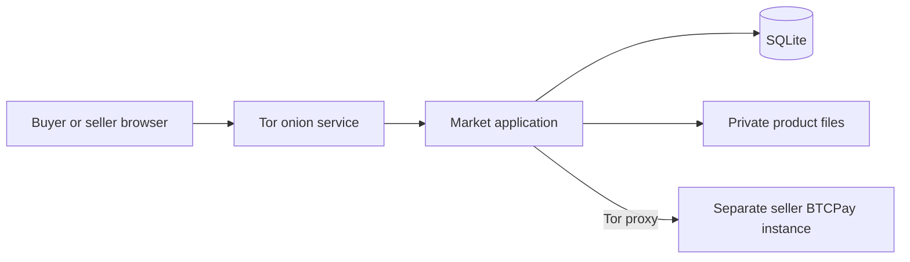

# Market

Market is a reference implementation of a marketplace for multiple sellers of physical goods and digital downloads. This repository shows how the application works and how to set up your own instance. Bitcoin and Monero are the supported payment assets.

**There is no hosted demo or running service associated with this repository.** The screenshots are development previews. Cloning or browsing the repository does not start hosting anything.


## How it works

For a complete walkthrough, read [setup from a fresh clone](docs/SETUP.md), [operating procedures and recovery](docs/OPERATIONS.md), and [implementation and development procedure](docs/IMPLEMENTATION.md). The shorter sections below provide an overview.

The React interface talks to an Express API. SQLite stores accounts, listings and orders; private files hold digital products. The optional Docker setup routes requests through a Tor v3 onion service to an application on an internal Docker network. No HTTP or SOCKS port is published to the host.



Accounts use pseudonyms. Sellers upload physical or digital listings, and an administrator approves them. Buyers reserve stock and receive an invoice from the seller's BTCPay instance. The application verifies invoice identity, currency, amount and settlement before enabling fulfillment. Digital purchases unlock a protected download; physical purchases use shipping updates. Order participants can exchange private messages and buyers can review fulfilled purchases.

The application does not hold wallet keys, pool customer balances or provide escrow. The automated suite uses payment fixtures; a separate disposable integration run also completed actual Bitcoin regtest and Monero fakechain transfers through BTCPay. Each seller must configure and verify their own connection. See [payment setup](docs/PAYMENTS.md).

## Explore and test locally

Requires Node 24.14 or newer and pnpm 11.19.0.

```powershell
pnpm install --frozen-lockfile
pnpm test
pnpm build
```

These commands install dependencies, run isolated tests and build frontend files. They do not start an onion service. The suite creates fictional data in temporary test directories and cleans it up afterward.

To explore the interface locally, run `pnpm start` and `pnpm dev` in separate terminals. Development listens on loopback. Stop the processes when finished. There are no default accounts, seeded live listings or payment credentials.

## Optional: run your own onion instance

Only follow this section if you intentionally want to host a service. Install Docker Desktop with its Linux engine running, or Docker Engine with Compose on a Linux host. From this directory:

```powershell
docker compose up --build -d
docker compose exec -T tor cat /onion/hostname
docker compose ps
```

On Windows, `Start Marketplace.cmd` runs the first command and `Show Onion Address.cmd` displays your newly generated address. Open your own address in a Tor capable browser. No specific operator address or identity key is included in this repository.

The app has only an internal Docker network. Tor supplies onion ingress and outbound BTCPay proxying. Production pins the generated onion hostname and refuses to start without it. Persistent volumes hold application data and the Tor identity. Run one app process per SQLite database. The host must remain running for an instance you start to remain available.

To stop your instance and retain data:

```powershell
docker compose down
```

To remove your instance and permanently discard its database, files and onion identity:

```powershell
docker compose down --volumes --remove-orphans
```

Deleting the Tor identity means a later setup generates a new address. Docker builds and test commands are available for reproducibility; GitHub Actions only tests and builds source and does not deploy a service.

## First administrator and seller

For an instance you choose to run, register a pseudonymous account through its website and grant it administrator access locally:

```powershell
docker compose exec -T app node scripts/admin.mjs promote YOUR_USERNAME
```

Reload to see Admin. Sellers use Sell to create listings; administrators approve new or edited listings. Digital listings require a file. Physical listings require shipping regions and a flat shipping charge in the listing currency. Connect a separate BTCPay instance before taking orders. There is no default administrator or password recovery flow.

## Privacy boundaries

No email requirement, analytics, remote fonts, remote scripts, advertising or application request access logging. Digital checkout does not request a delivery address. Shipping addresses, tracking details and private order messages use authenticated AES 256 GCM encryption before SQLite storage. Application endpoints restrict private order access to its two participants.

The running server can decrypt private fields. This protects a database copy without its key, not someone controlling the host or holding both. It is not end to end encryption. Ordinary order metadata, accounts, public reviews, listings, uploaded files and BTCPay configuration are outside this field protection. Read [privacy and operations](docs/PRIVACY.md).

## Verification and limits

[Verification notes](docs/VERIFICATION.md) document automated checks, actual test coin settlement, browser workflows over Tor, outage recovery and a backup restoration drill. Mainnet payments and independent user testing remain unverified. [Design notes](design/SPEC.md) record the interface research and visual comparison.

JavaScript is required. There is no automatic retention cleanup, account deletion or recovery, arbitration, marketplace commission, multi seller cart, email delivery, automated refunds or custody. Recording a refund records a seller statement and disables downloads; it does not send or independently verify a transfer. Partial payments and ambiguous invoice creation can require operator review. Functional tests are not a security audit or a guarantee of anonymity.

Public source visibility does not grant an open source license. No application license is supplied; dependencies retain their respective licenses.
