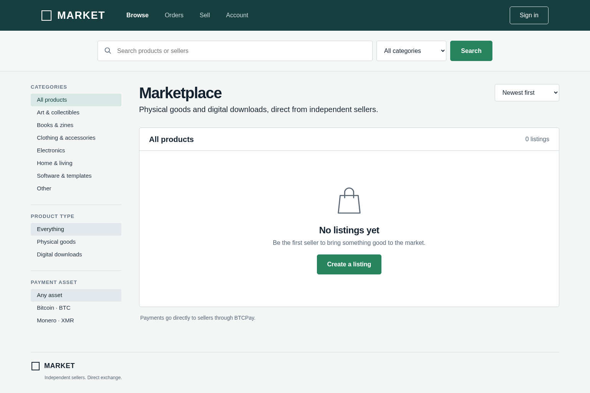

# Market

A private source marketplace for independent sellers of physical goods and digital downloads. The Docker deployment exposes the application only through a Tor v3 onion service. Bitcoin and Monero are the only payment assets.



Private source repository: [agammann/Market](https://github.com/agammann/Market). The image shows the previously deployed catalog; current source uses Market casing and adds a privacy footer link. Run the start command below to deploy the latest source.

## Working functionality

Pseudonymous accounts, seller profiles, moderated listings, category and text search, image uploads with metadata removed, stock reservation, exact cryptocurrency prices, purchase histories, private order conversations, shipping updates, purchase reviews, and protected digital downloads. Operators approve listings and review reports. No invented listings or sales are seeded into the deployed database.

Payments use BTCPay Greenfield invoices. Each seller connects a separate BTCPay onion instance. The application does not hold private wallet keys, pool customer balances, or provide escrow. Only provider settlement unlocks delivery. Sellers cannot mark an unpaid marketplace order paid.

**Live payment setup remains unconfigured.** Tests use an explicit payment test double and transport fixtures. No real BTC or XMR payment has been accepted or verified. Checkout is unavailable until the seller has a connection. See [payment setup](docs/PAYMENTS.md).

## Start the onion service

Install Docker Desktop with its Linux engine running. On Windows, open `Start Marketplace.cmd`, then `Show Onion Address.cmd`. Open the displayed address in a Tor capable browser. The generated address is intentionally absent from this repository.

Equivalent commands, from this directory:

```powershell
docker compose up --build -d
docker compose exec -T tor cat /onion/hostname
docker compose ps
```

There are no published HTTP or SOCKS ports. The app belongs only to an internal Docker network. Tor provides onion ingress and proxies outbound BTCPay requests. The production process pins the generated onion hostname and refuses to start without it.

The computer must stay awake with Docker running. This is hosting on your computer, not a cloud service. `Stop Marketplace.cmd` stops containers and retains volumes. Removing volumes loses data or changes the onion identity.

## First administrator and seller

Register a pseudonymous account through the onion website, then grant that account administrator access locally:

```powershell
docker compose exec -T app node scripts/admin.mjs promote YOUR_USERNAME
```

Reload the page to see Admin. Sellers create listings through Sell; an administrator approves each new or edited listing. Digital listings require an uploaded file. Physical listings require shipping regions and a flat shipping charge in the listing currency. Connect a separate BTCPay instance before taking orders. There are no default passwords or administrator accounts, and no password recovery flow.

## Privacy boundaries

No email requirement, analytics, remote fonts, remote scripts, advertising, or request access logging. Digital checkout does not collect shipping details. Shipping addresses, tracking details, and private order messages are encrypted with authenticated AES 256 GCM before storage. Only order participants can retrieve them through application endpoints, even when another account is an administrator.

The server can decrypt private fields. Encryption protects a database copy without its key; it does not protect against someone controlling the host or holding both database and key. This is not end to end encryption. Order metadata, accounts, reviews, listings, upload files, and BTCPay configuration are outside this field protection. Read [privacy and operations](docs/PRIVACY.md) before using real customer data.

## Development and validation

Requires Node 24.14 or newer and pnpm 11.19.0.

```powershell
pnpm install --frozen-lockfile
pnpm test
pnpm build
```

For an isolated development copy, run `pnpm start` and `pnpm dev` in separate terminals. Development binds to loopback and is separate from the onion deployment. Do not point it at production data. Run one app process per SQLite database.

GitHub Actions runs tests and builds the frontend. [Verification](docs/VERIFICATION.md) distinguishes live Tor checks from payment fixtures. [Design notes](design/SPEC.md) record research and visual comparison.

## Current limits

JavaScript is required. There is no automatic retention cleanup, account deletion or recovery, arbitration, marketplace commission, multi seller cart, email delivery, automated refunds, or custody service. Recording a refund records a seller statement and disables downloads; it does not send or independently verify a refund. Partial payments and ambiguous invoice creation can require operator review. Functional checks are not an independent security audit or a guarantee of anonymity.

This repository is private. No open source license is granted for the application. Dependencies retain their respective licenses.
